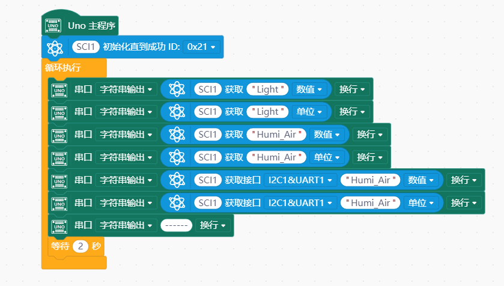
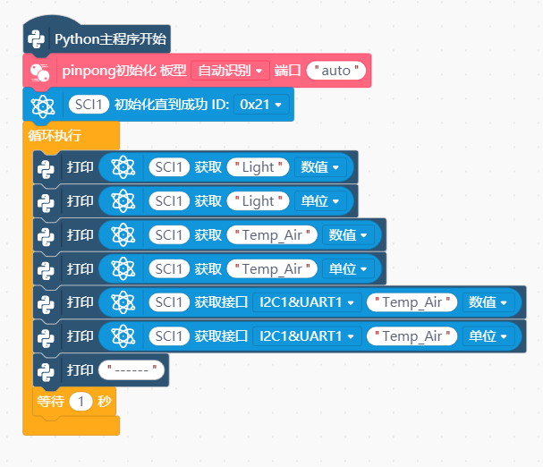

# Gravity SCI 采集模块


---------------------------------------------------------

## Table of Contents

* [URL](#url)
* [Summary](#summary)
* [Blocks](#blocks)
* [License](#license)
* [Supported targets](#Supportedtargets)

## URL
* Project URL : ```https://gitee.com/liliang9693/ext-scl```

* Tutorial URL : ```https://mindplus.dfrobot.com.cn/extensions-user```

* wiki URL : ```http://wiki.dfrobot.com.cn```


## Summary
此扩展支持DFRobot出品的Gravity:SCI采集模块。
SKU:DFR0999 SCI采集模块是一款多功能数据采集模块，可连接多种传感器，自动识别统一数据输出。

## Blocks


## Examples

  
  

## License

MIT

## Supported targets

MCU                | JavaScript    | Arduino   | MicroPython    | unihiker
------------------ | :----------: | :----------: | :---------: | -----
arduino        |             |        √      |             | 
micro:bit V1       |             |       √       |             | 
micro:bit V2      |             |       x       |             | 
esp32        |             |        √      |             | 
python        |             |              |             |  √

## Release Logs
* V0.0.1  基础功能完成,micro:bit V2不支持

