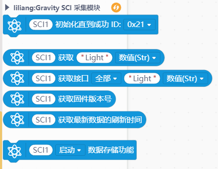

# Gravity SCI 采集模块


---------------------------------------------------------

## Table of Contents

* [URL](#url)
* [Summary](#summary)
* [Blocks](#blocks)
* [License](#license)
* [Supported targets](#Supportedtargets)

## URL
* Project URL : ```https://gitee.com/liliang9693/ext-scl```

* Tutorial URL : ```https://mindplus.dfrobot.com.cn/extensions-user```

* wiki URL : ```http://wiki.dfrobot.com.cn```


## Summary
此扩展支持DFRobot出品的Gravity:SCI采集模块。
SKU:DFR0999 SCI采集模块是一款多功能数据采集模块，可连接多种传感器，自动识别统一数据输出。

## Blocks




## Examples
### 上传模式
  
### Python模式行空板
#### 图形化方式：
注意先要将行空板上的pinpong库版本升级到最新版本，升级方法：```https://wiki.unihiker.com/pip_install```  
  
#### 代码方式：

```python
#  -*- coding: UTF-8 -*-

# MindPlus
# Python
# 此代码将SCI模块连接行空板，可以读取SCI模块上连接的光线传感器的数据
# 注意1：需要将https://gitee.com/liliang9693/ext-scl仓库中dfrobot_rp2040_suab.py库文件与本代码一起运行
# 注意2：需要将行空板上的pinpong库版本升级到0.4.9及以上版本，升级方法：https://wiki.unihiker.com/pip_install
from dfrobot_rp2040_suab import *
from pinpong.board import Board
import time


Board().begin()
SCI1 = DFRobot_SUAB_IIC(addr=0x21) #SCI屏幕左上角ID显示的地址
while SCI1.begin() != 0:
    print("Initialization Sensor Universal Adapter Board failed.")
    time.sleep(1)
print("Initialization Sensor Universal Adapter Board done.")

while True:
    print(SCI1.get_value0("Light"))
    print(SCI1.get_unit0("Light"))
    print(SCI1.get_value1(SCI1.eAD,"Light"))
    print(SCI1.get_unit1(SCI1.eAD,"Light"))
    print(SCI1.get_value1(SCI1.eAD,"Light"))
    print(SCI1.get_unit1(SCI1.eAD,"Light"))
    print(SCI1.get_value1(SCI1.eAD,"Light"))
    print(SCI1.get_unit1(SCI1.eAD,"Light"))
    print("----------------")
    time.sleep(1)

```
## License

MIT

## Supported targets

MCU                | JavaScript    | Arduino   | MicroPython    | unihiker
------------------ | :----------: | :----------: | :---------: | -----
arduino        |             |        √      |             | 
micro:bit V1       |             |       √       |             | 
micro:bit V2      |             |       x       |             | 
esp32        |             |        √      |             | 
python        |             |              |             |  √

## Release Logs
* V0.0.1  基础功能完成,micro:bit V2不支持
* V0.0.2  调整积木，增加按照接口获取数据，增加获取单位功能
* V0.0.3  调整库，解决int转换报错问题
* V0.0.4  解决掌控加载扩展库报错问题，放出microbit支持，V2暂不支持
* V0.0.5  更换为适配1.0.1新固件，库更新，增加获取版本号及获取时间戳积木

